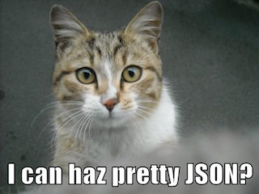

What is This?
=============


Utilities for printing JSON to the Linux command line (like the `cat` command) in a human-readable format

Available in multiple languages (PHP, GoLang, Python, and Node.js for now), making use of any built-in JSON processing capabilities of a given language

Download and Install
====================
Fetch any [**jsoncat**](https://github.com/mariten/json-cat/blob/master/bin/) from the master branch `bin` directory of this repository, located in the `bin` directory.

It is recommended to name the downloaded script as `jsoncat` and set it to be executable.

### Install GoLang Version
```bash
cd ~/bin
wget --no-check-certificate -O jsoncat.go \
'https://raw.githubusercontent.com/mariten/json-cat/master/bin/golang-jsoncat.go'
go build jsoncat.go
rm jsoncat.go
chmod +x jsoncat
```

### Install Node.js Version
```bash
cd ~/bin
wget --no-check-certificate -O jsoncat \
'https://raw.githubusercontent.com/mariten/json-cat/master/bin/node-jsoncat.sh'
chmod +x jsoncat
```

### Install Python Version
**Requires Python 2.6 or above**
```bash
cd ~/bin
wget --no-check-certificate -O jsoncat \
'https://raw.githubusercontent.com/mariten/json-cat/master/bin/python-jsoncat.py'
chmod +x jsoncat
```

### Install PHP Version
```bash
cd ~/bin
wget --no-check-certificate -O jsoncat \
'https://raw.githubusercontent.com/mariten/json-cat/master/bin/php-jsoncat.php'
chmod +x jsoncat
```

Usage
=====
Assuming that your `~/bin` folder is set in your PATH environment variable:

```bash
jsoncat path/to/json/file/test.json
```

Examples
========
### Without `jsoncat` (Ugly)
```
$ cat ~/tmp/test.json

{"id":105,"name":"Cat bookend","price":29.99,"tags":["home","pets","cats"]}
```

### With `jsoncat` (Pretty)
```
$ jsoncat ~/tmp/test.json

{
    "id": 105,
    "name": "Cat bookend",
    "price": 29.99,
    "tags": [
        "home",
        "pets",
        "cats"
    ]
}
```

### Mix with `grep`
```
$ jsoncat ~/tmp/test.json | grep price

    "price": 29.99,
```
